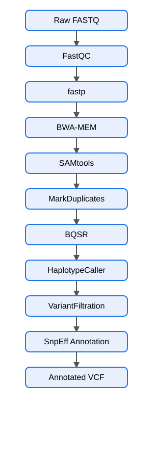

# 🧬 Human Germline Variant Calling using GATK


---

## 📖 Project Overview

This project implements a reproducible **single-sample human germline variant-calling workflow** using key steps from the GATK Best Practices framework.

Starting from paired-end Illumina FASTQ files, the workflow performs:

- Raw read quality control
- Adapter and quality trimming
- Read alignment to GRCh38
- SAM/BAM processing
- Duplicate marking
- Base Quality Score Recalibration (BQSR)
- Germline variant calling with GATK HaplotypeCaller
- Variant hard filtering
- Functional annotation using SnpEff

The analysis was performed using a **Genome in a Bottle (GIAB) NIST7035 sample**.

The repository is designed to demonstrate practical experience in:

- NGS data analysis
- Germline variant calling
- GATK workflows
- Linux/WSL
- Bash scripting
- Conda environment management
- Variant annotation
- Reproducible bioinformatics workflows

---

## 🎯 Objectives

1. Perform quality assessment of raw sequencing reads.
2. Trim adapters and low-quality bases.
3. Align paired-end reads to the GRCh38 reference genome.
4. Convert, sort and index alignment files.
5. Mark PCR/optical duplicates.
6. Perform Base Quality Score Recalibration.
7. Call germline variants using GATK HaplotypeCaller.
8. Apply hard-filtering criteria to the variant callset.
9. Annotate variants using SnpEff.
10. Organize the analysis into a reproducible Bash-based workflow.

---

## 🧬 Dataset

### Sample

**NIST7035**

### Source

Genome in a Bottle (GIAB)

### Sequencing

Paired-end Illumina sequencing

The raw FASTQ files are not included in this repository because of their large size.

See:

```text
data/raw/README.md
```

for information about the expected input files.

---

## 🧬 Reference Genome

The workflow uses:

**GRCh38**

Reference:

```text
GCA_000001405.15_GRCh38_no_alt_analysis_set
```

The reference genome and its BWA/GATK indexes are not included in the repository because of their large size.

See:

```text
data/reference/README.md
```

---

## 🔬 Pipeline Workflow

<p align="center">
  
</p>

---

## 🛠 Software and Versions

### Main variant-calling environment

| Software | Version |
|---|---:|
| Java | 17.0.18 |
| GATK | 4.6.2.0 |
| SAMtools | 1.24 |
| FastQC | 0.12.1 |
| fastp | 1.3.6 |
| BWA-MEM | BWA |
| Picard | 3.4.0 |
| Python | 3.11 |

### SnpEff annotation environment

| Software | Version |
|---|---:|
| Java | 21.0.10 |
| SnpEff | 5.4c |
| Database | GRCh38.115 |

Two Conda environments are used because SnpEff 5.4c requires a newer Java runtime than the Java version used by the main GATK environment.

Environment specifications:

```text
environment.yml
environment_snpeff.yml
```

---

## 📁 Repository Structure

```text
Human-Germline-Variant-Calling-GATK-Best-Practices/
│
├── README.md
├── LICENSE
├── .gitignore
│
├── environment.yml
├── environment_snpeff.yml
│
├── data/
│   ├── raw/
│   │   └── README.md
│   ├── reference/
│   │   └── README.md
│   └── known_sites/
│       └── README.md
│
├── scripts/
│   ├── 00_setup.sh
│   ├── 01_fastqc.sh
│   ├── 02_fastp.sh
│   ├── 03_bwa_alignment.sh
│   ├── 04_markduplicates.sh
│   ├── 05_bqsr.sh
│   ├── 06_haplotypecaller.sh
│   ├── 07_variantfiltration.sh
│   ├── 08_snpeff_annotation.sh
│   └── run_pipeline.sh
│
├── results/
│   ├── fastqc/
│   ├── trimmed/
│   ├── alignment/
│   ├── variants/
│   └── annotation/
│
├── figures/
│   └── pipeline_workflow.svg
│
├── docs/
└── logs/
```

Large sequencing, reference, alignment and annotation files are excluded through `.gitignore`.

---

## 🔬 Methods

### 1. Quality Control

FastQC was used to assess the quality of the raw paired-end reads.

### 2. Read Trimming

fastp was used for adapter removal and quality trimming.

HTML and JSON reports were retained for quality assessment.

### 3. Read Alignment

Trimmed reads were aligned to GRCh38 using BWA-MEM.

The workflow generated:

```text
SAM
↓
BAM
↓
Coordinate-sorted BAM
↓
BAM index
```

### 4. Duplicate Marking

GATK/Picard MarkDuplicates was used to identify and mark duplicate reads.

Duplicate metrics were retained as a QC output.

### 5. Base Quality Score Recalibration

GATK BaseRecalibrator and ApplyBQSR were used with known-sites resources including:

- dbSNP138
- Mills and 1000G Gold Standard Indels

### 6. Germline Variant Calling

GATK HaplotypeCaller was used to generate the raw germline variant callset.

### 7. Variant Filtering

Hard-filtering was applied using the following annotations:

```text
QD < 2.0
FS > 60.0
MQ < 40.0
```

These thresholds were applied to the single-sample variant callset.

### 8. Functional Annotation

SnpEff 5.4c was used with the:

```text
GRCh38.115
```

database to predict the functional effects of detected variants.

---

## 📊 Results

### Variant Calling Summary

| Metric | Number |
|---|---:|
| Raw variants | 283,102 |
| PASS variants | 271,726 |
| Filtered variants | 11,376 |

### Filtering outcome

```text
Raw variants
    │
    ├── PASS       271,726
    │
    └── Filtered    11,376
```

The filtered VCF and its tabix index are included in the repository.

---

## 📈 Functional Annotation

The filtered variant callset was annotated using:

**SnpEff 5.4c**

Database:

```text
GRCh38.115
```

The resulting annotated VCF was generated locally but is excluded from GitHub because of its large file size.

---

## 💻 Skills Demonstrated

- Next Generation Sequencing (NGS)
- Germline variant calling
- Linux / Ubuntu WSL
- Bash scripting
- Conda environment management
- FastQC
- fastp
- BWA-MEM
- SAMtools
- GATK
- Picard
- HaplotypeCaller
- VariantFiltration
- SnpEff
- GRCh38 genome analysis
- BQSR
- VCF processing
- Reproducible bioinformatics workflows

---

## 🚀 Reproducibility

### Main environment

```bash
conda env create -f environment.yml
conda activate variant_calling
```

Check the installation:

```bash
./scripts/00_setup.sh
```

Run the main workflow:

```bash
./scripts/run_pipeline.sh
```

### SnpEff environment

After completing the main variant-calling workflow:

```bash
conda env create -f environment_snpeff.yml
conda activate snpeff_env
```

Then run:

```bash
./scripts/08_snpeff_annotation.sh
```

---

## 📦 Data Availability

Large input and intermediate files are intentionally excluded from this repository, including:

- Raw FASTQ files
- GRCh38 reference genome
- Reference genome indexes
- Known-sites VCF files
- Large BAM files
- Trimmed FASTQ files
- Large annotated VCF

Instructions for the required input resources are provided in the corresponding `data/` README files.

---

## 🔮 Future Improvements

Potential extensions include:

- Variant Quality Score Recalibration (VQSR)
- Multi-sample joint genotyping
- Variant Effect Predictor (VEP)
- ANNOVAR annotation
- Structural variant calling
- Additional variant QC and visualization
- Automated workflow management using Nextflow or Snakemake

---

## 📚 Software

This project makes use of:

- GATK
- BWA
- SAMtools
- FastQC
- fastp
- Picard
- SnpEff

Please consult the official documentation and publications associated with each software package when using this workflow.

---

## 👩‍💻 Author

**Lopamudra Basu**

M.Sc. Biotechnology

Bioinformatics | Genomics | Transcriptomics | NGS Analysis

---

⭐ If you found this repository useful, consider giving it a star.
